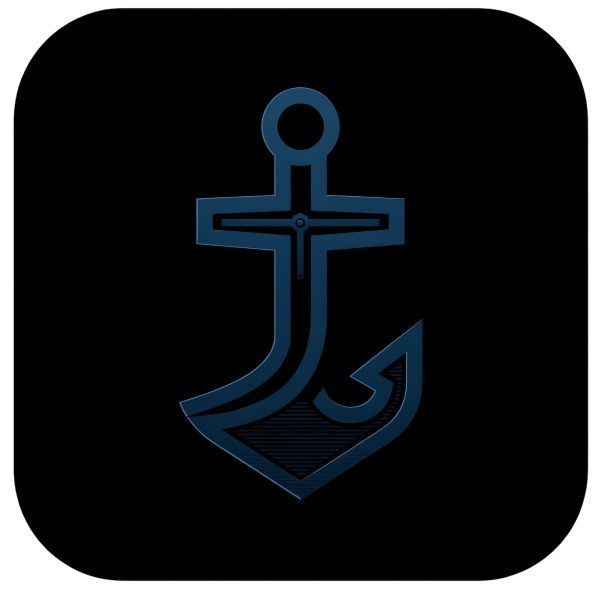
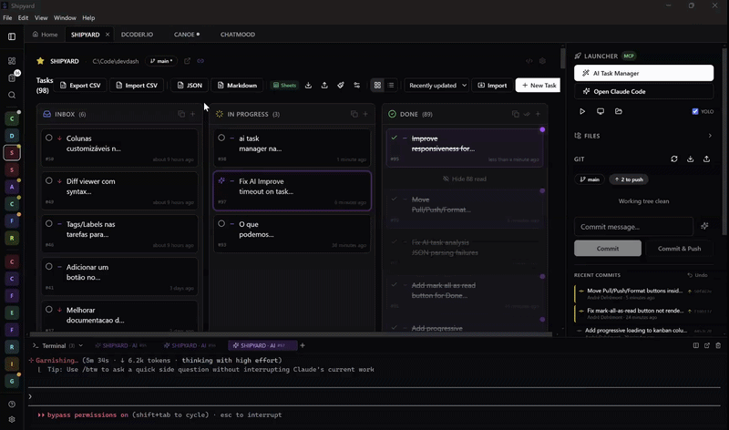

> [!IMPORTANT]
> **Active Fork Notice:** This repository is a fork of the original [Shipyard](https://github.com/defremont/Shipyard) by **defremont**. 
> It is maintained by **awilliansd** to include new features, bug fixes, and improvements that are not present in the upstream version.

---


<p align="center">
  
</p>

<h1 align="center">Dockyard</h1>

<p align="center">
  Local development dashboard &mdash; manage projects, tasks, git, and terminals from your browser.
</p>

<p align="center">
  <a href="https://github.com/awilliansd/dockyard/releases/latest"></a>
  <a href="https://github.com/awilliansd/dockyard"></a>
  
  
  
  
</p>

---

<p align="center">
  <a href="https://github.com/awilliansd/dockyard/releases/latest"></a>&nbsp;
  <a href="https://github.com/awilliansd/dockyard/releases/latest"></a>&nbsp;
  <a href="https://github.com/awilliansd/dockyard/releases/latest"></a>
</p>

<p align="center">
  
</p>

## Why Dockyard

- **Local-first** -- runs entirely on `localhost`. No cloud services, no accounts, no telemetry. Your data stays on your machine as plain JSON files.
- **Complements your editor** -- Dockyard is not an IDE. It sits alongside VS Code (or whatever you use) and gives you a bird's-eye view of all your projects, tasks, and git status in one place.
- **Cross-platform** -- works on Linux, macOS, and Windows. Launches native terminals, file managers, and VS Code with one click.
- **Multi-provider AI** -- bring your own key for **Claude**, **OpenAI**, **Gemini**, or run models locally with **Ollama**. AI powers chat, task analysis, bulk task creation, commit message generation, and an agentic assistant with file tools.

## Features

**Dashboard** -- See all your projects at a glance with live git status, branch info, tech stack detection, and task counts. A "Working On" banner shows in-progress tasks across all projects.

**Kanban Board** -- Per-project task management with drag-and-drop columns (Inbox, In Progress, Done). Priority levels, descriptions, and technical prompts for each task. Switch to a **list view** for a compact alternative. A global task view across all projects is also available.

**Milestones** -- Group tasks into milestones for phased work. A virtual "General" milestone holds ungrouped tasks. Create, close, and reorder milestones per project.

**Git Panel** -- Stage, unstage, commit, push, pull, view diffs, and browse commit history without leaving the browser. Live indicators show unpushed commits, unstaged changes, and untracked files. Supports **multi-repo projects** with sub-repository tabs. **AI-generated commit messages** -- one click to draft a commit message from your staged diff using any configured AI provider.

**Terminal Integration** -- Launch Open Claude, dev servers, shells, VS Code, or your file manager with one click. Run terminals directly in the browser via xterm.js (requires `node-pty`). PowerShell on Windows, bash/zsh on Linux/macOS.

**Code Editor** -- Browse and edit project files with a CodeMirror-based editor, syntax highlighting, and tabbed interface. Preview diffs side-by-side before committing.

**File Explorer** -- Browse project files in a tree view with lazy loading. Preview markdown, code, and images in a dialog.

**Multi-Provider AI** -- Configure one or more AI providers in Settings:

| Provider | Key Required | Notes |
|----------|:---:|-------|
| Anthropic Claude | ✅ | claude-3-opus, sonnet, haiku |
| OpenAI | ✅ | gpt-4o, gpt-4-turbo, gpt-3.5-turbo |
| Google Gemini | ✅ | gemini-2.0-flash, gemini-1.5-pro/flash |
| Ollama (local) | ❌ | Any model you've pulled locally |

AI capabilities include:
- **Chat** -- project-aware streaming chat in the workspace sidebar
- **Task analysis** -- AI generates descriptions and implementation prompts for tasks
- **Bulk task creation** -- paste unstructured text and let AI parse it into structured tasks with titles, priorities, and statuses
- **Task management** -- describe what you want in natural language and AI creates/updates tasks
- **Commit messages** -- generate commit messages from staged diffs
- **AI Assistant** -- agentic chat that can list, read, and write project files using tools (up to 6 tool-use steps per request)

All API keys are encrypted with AES-256-GCM on disk and never exposed to the browser.

**Open Claude Integration** -- Launch Open Claude directly in the browser terminal. Supports normal mode and `--dangerously-skip-permissions` (YOLO) mode. AI Resolve sends a task prompt to Open Claude and auto-detects when the CLI is ready for input using content-based and silence-based detection with retry logic.

**MCP Server** -- Expose Dockyard as a Model Context Protocol server. Claude Desktop, Claude Code, or any MCP client can list projects, manage tasks, and read git status. Secured with OAuth 2.1 + PKCE.

**Google Sheets Sync** -- Bidirectional sync of tasks with a Google Sheet via Apps Script. Auto-push on changes, auto-pull every 30 seconds, with per-task merge based on timestamps. No Google API keys needed.

**Bulk Import** -- Import tasks from CSV files or unstructured text. A review dialog lets you map columns, adjust priorities, and preview before importing.

**Export** -- JSON backup and Markdown export (checklist, table, or detailed format) for sharing with teams or clients.

**Multi-tab Workspace** -- Open multiple projects simultaneously in tabs, switch instantly between them.

**Command Palette** -- `Ctrl+K` to quickly search and jump to any project, task, or action.

**Logs** -- Built-in log viewer with filtering, stats, and level breakdown. Useful for debugging server-side issues.

## Download

Pre-built desktop installers are available on the [Releases](https://github.com/awilliansd/dockyard/releases/latest) page:

| Platform | File |
|----------|------|
| Windows | `Dockyard-Setup-x.x.x.exe` |
| macOS (Apple Silicon) | `Dockyard-x.x.x-arm64.dmg` |
| macOS (Intel) | `Dockyard-x.x.x-x64.dmg` |
| Linux | `Dockyard-x.x.x.AppImage` or `.deb` |

Or run from source:

## Quick Start

### Prerequisites

- [Node.js](https://nodejs.org/) >= 18
- [pnpm](https://pnpm.io/) (`npm install -g pnpm`)
- [git](https://git-scm.com/)

### Install and Run

```bash
git clone https://github.com/awilliansd/dockyard.git
cd dockyard
pnpm install
pnpm dev
```

Open [http://localhost:5421](http://localhost:5421).

### Automated Setup (optional)

The setup scripts install dependencies and optionally create launch shortcuts:

| OS | Command |
|----|---------| 
| Linux / macOS | `chmod +x setup.sh && ./setup.sh` |
| Windows | `setup.cmd` |

### Launch Shortcuts

| OS | Command | Description |
|----|---------|-------------|
| Any | `pnpm dev` | Starts client (port 5421) + server (port 5420) |
| Linux / macOS | `./dockyard.sh` | Starts server and opens browser |
| Windows | `dockyard.cmd` | Starts server and opens browser |

**Shell alias** (Linux/macOS):

```bash
# Add to ~/.bashrc or ~/.zshrc
alias dockyard='cd /path/to/dockyard && ./dockyard.sh'
```

### Integrated Terminal (optional)

The in-browser terminal requires `node-pty`, which is listed as an optional dependency. If it fails to compile during install, everything else works normally -- terminal launchers will open native OS terminals instead.

## First Run

On first launch, Dockyard shows a setup wizard that walks you through adding projects, explains the core features, and provides a quick reference. You can skip it and configure projects later in Settings.

## How It Works

### Dashboard

The home screen shows all your registered projects with live git indicators (branch, uncommitted changes, unpushed commits). The "Working On" section highlights in-progress tasks across all projects. Click any project to open its workspace in a tab.

### Workspace

Each project opens in a tabbed workspace with two panels:

- **Left (3/4)**: Kanban board with drag-and-drop between Inbox, In Progress, and Done columns. Toggle to a list view for a compact alternative.
- **Right (1/4)**: Quick Launch buttons, AI context tools, file explorer, code editor, and Git panel.

### Task Workflow

Create tasks with a title, description, priority, and optional technical prompt. The prompt field is designed for implementation details -- causes, files, solutions -- that can be copied directly to an AI coding assistant.

Tasks track timestamps for each stage (inbox, in-progress, done) automatically with cascading logic.

### Milestones

Group related tasks into milestones for phased work. A virtual "General" milestone holds ungrouped tasks. Deleting a milestone moves its tasks back to General.

### AI-Powered Workflows

1. **Analyze a task**: click the ✨ button on any task to auto-generate a description and technical prompt
2. **Bulk create tasks**: paste meeting notes, requirements, or any unstructured text and AI parses it into structured tasks
3. **Generate commit messages**: stage your changes, click the AI button in the Git panel, and get a conventional commit message
4. **Chat with context**: open the AI chat panel to ask questions with full project context (tasks, git status, file tree)
5. **Assistant mode**: let the AI read and edit project files autonomously using tool-use capabilities

### Terminal Launchers

Dockyard detects your OS and opens native terminals:

| Action | Linux | macOS | Windows |
|--------|-------|-------|---------|
| Terminal | gnome-terminal | Terminal.app | Windows Terminal (wt.exe) |
| VS Code | `code` | `code` | `code` |
| File manager | xdg-open | open | explorer.exe |

Terminal titles follow the pattern `[project-name] Type` (e.g., `[my-app] Dev`, `[my-app] Shell`).

On Windows, the integrated terminal uses PowerShell (better ConPTY support and readline). Native launchers use `cmd.exe` to avoid triggering WSL.

## Stack

| Layer | Technology |
|-------|-----------| 
| Frontend | React 18 + Vite + TypeScript + Tailwind CSS + shadcn/ui |
| Backend | Fastify 5 + TypeScript (via tsx) |
| AI | Pluggable provider system (Claude, OpenAI, Gemini, Ollama) |
| Editor | CodeMirror 6 |
| Data | JSON files (no database) |
| Monorepo | pnpm workspaces (client + server) |

## Desktop App

Dockyard can be packaged as a standalone desktop app using Electron. The server runs as a child process, and data is stored in the OS-appropriate app data directory.

```bash
pnpm dist:win     # Windows (.exe installer)
pnpm dist:mac     # macOS (.dmg)
pnpm dist:linux   # Linux (.AppImage + .deb)
```

Features: system tray icon, single-instance lock, auto-start server.

## Data and Privacy

All data is stored locally in a `data/` directory as plain JSON files. Nothing is sent to any cloud service (except when you explicitly use AI providers or Google Sheets sync).

- **Projects**: registered paths and cached metadata
- **Tasks**: one JSON file per project (includes milestones)
- **AI provider configs**: encrypted with AES-256-GCM per provider, stored in `data/providers/`
- **Sync config** (Google Sheets URLs): stored only in your browser's localStorage, not on the server

### Portability

You can move your data between machines by:

1. **Export/Import** -- download tasks as JSON or CSV, import on the other machine
2. **Google Sheets** -- both machines sync to the same spreadsheet
3. **Cloud folder** -- symlink `data/` to a Dropbox/OneDrive/iCloud folder
4. **Private git repo** -- version the `data/` directory

## Google Sheets Sync

Sync a project's tasks bidirectionally with a Google Sheet using a free Apps Script web app. No Google API keys or OAuth setup required.

### Setup

1. Create a new Google Sheet
2. Open **Extensions > Apps Script**
3. Replace the default code with the script below
4. Click **Deploy > New deployment > Web App**
5. Set **Execute as**: Me, **Who has access**: Anyone
6. Copy the deployment URL
7. In Dockyard, open a project and click the **Sheets** button in the task board header
8. Paste the URL, click **Test**, then **Save**

### Apps Script

```javascript
const HEADERS = ['id', 'title', 'description', 'priority', 'status', 'prompt', 'updatedAt'];

function doGet(e) {
  const action = (e && e.parameter && e.parameter.action) || 'read';
  const sheet = SpreadsheetApp.getActiveSpreadsheet().getActiveSheet();

  if (action === 'ping') {
    return jsonResp({ ok: true, rows: Math.max(0, sheet.getLastRow() - 1) });
  }

  const data = sheet.getDataRange().getValues();
  if (data.length < 2) return jsonResp({ tasks: [] });

  var headers = data[0].map(function(h) { return String(h).toLowerCase().trim(); });
  var tasks = [];
  for (var i = 1; i < data.length; i++) {
    var row = data[i];
    if (!row.some(function(c) { return String(c).trim(); })) continue;
    var task = {};
    headers.forEach(function(h, idx) { task[h] = String(row[idx] || ''); });
    if (task.title) tasks.push(task);
  }
  return jsonResp({ tasks: tasks });
}

function doPost(e) {
  try {
    var payload = JSON.parse(e.postData.contents);
    var tasks = payload.tasks || [];
    var sheet = SpreadsheetApp.getActiveSpreadsheet().getActiveSheet();
    sheet.clear();
    sheet.appendRow(HEADERS);
    for (var i = 0; i < tasks.length; i++) {
      var t = tasks[i];
      sheet.appendRow(HEADERS.map(function(h) { return t[h] || ''; }));
    }
    if (HEADERS.length > 0) sheet.autoResizeColumns(1, HEADERS.length);
    return jsonResp({ success: true, updated: tasks.length });
  } catch (err) {
    return jsonResp({ error: err.message });
  }
}

function jsonResp(data) {
  return ContentService
    .createTextOutput(JSON.stringify(data))
    .setMimeType(ContentService.MimeType.JSON);
}

// Auto-update updatedAt when editing cells manually
function onEdit(e) {
  var sheet = e.source.getActiveSheet();
  var row = e.range.getRow();
  if (row < 2) return;
  var headers = sheet.getRange(1, 1, 1, sheet.getLastColumn()).getValues()[0];
  var col = headers.indexOf('updatedAt');
  if (col === -1) return;
  if (e.range.getColumn() === col + 1) return;
  sheet.getRange(row, col + 1).setValue(new Date().toISOString());
}
```

### How Sync Works

- **Auto-push**: every task change pushes to the sheet after a 2-second debounce
- **Auto-pull**: polls the sheet every 30 seconds and merges changes silently
- **Merge logic**: per-task comparison using `updatedAt` timestamps. The newest version wins. New tasks from either side are preserved.
- **Manual push/pull**: buttons in the task board header for on-demand sync
- The backend is a stateless proxy -- it validates the Apps Script URL and forwards requests

### Multi-machine Workflow

1. Machine A: configure the sheet URL, push tasks
2. Machine B: install Dockyard, add the same project, configure the same sheet URL, pull
3. Both machines stay in sync via the shared spreadsheet

## Project Structure

```
dockyard/
├── client/                  # Frontend (port 5421)
│   ├── src/
│   │   ├── components/      # UI components (shadcn/ui)
│   │   │   ├── claude/      # AI chat panel, config, task analysis
│   │   │   ├── editor/      # CodeMirror editor, diff view, tabs
│   │   │   ├── files/       # File explorer tree
│   │   │   ├── git/         # Git panel, commit form, diff viewer
│   │   │   ├── layout/      # App shell, sidebar, command palette
│   │   │   ├── mcp/         # MCP server config
│   │   │   ├── onboarding/  # Welcome wizard
│   │   │   ├── projects/    # Project cards, dashboard widgets
│   │   │   ├── sync/        # Google Sheets sync UI
│   │   │   ├── tasks/       # Kanban board, list view, task editor,
│   │   │   │                # bulk import, CSV review, milestones
│   │   │   ├── terminals/   # Terminal panel, launcher, integrated terminal
│   │   │   └── ui/          # shadcn/ui primitives
│   │   ├── hooks/           # React Query hooks (useProjects, useTasks,
│   │   │                    # useGit, useClaude, useTerminal, useAiSessions,
│   │   │                    # useMilestones, useSheetSync, useFiles,
│   │   │                    # useEditorTabs, useLogs, useMcp, useTabs)
│   │   ├── pages/           # Dashboard, Workspace, TasksPage, Settings,
│   │   │                    # Help, LogsPage
│   │   └── lib/             # API client, sync providers, utilities
│   └── public/
├── server/                  # Backend API (port 5420)
│   └── src/
│       ├── routes/          # REST + WebSocket + MCP endpoints
│       │                    # (ai, files, git, logs, mcp, projects,
│       │                    #  settings, sync, tasks, terminals, terminalWs)
│       └── services/
│           ├── ai/          # Pluggable AI provider system
│           │   ├── providers/  # claude, openai, gemini, ollama
│           │   ├── assistantAgent.ts   # Agentic tool-use loop
│           │   ├── assistantTools.ts   # File list/read/write tools
│           │   ├── security.ts         # AES-256-GCM key encryption
│           │   └── types.ts            # Provider interface contracts
│           ├── gitService.ts
│           ├── taskStore.ts
│           ├── terminalLauncher.ts      # Native terminal launchers
│           ├── terminalService.ts       # Integrated terminal (node-pty)
│           ├── mcpServer.ts / mcpAuth.ts
│           └── ...
├── electron/                # Desktop app wrapper
├── data/                    # Local data (auto-created, gitignored)
├── setup.sh                 # Linux/macOS setup
├── setup.cmd                # Windows setup
├── dockyard.sh              # Linux/macOS launcher
└── dockyard.cmd             # Windows launcher
```

## API Reference

<details>
<summary>Click to expand full API routes</summary>

| Area | Endpoints |
|------|-----------|
| **Projects** | `GET /api/projects`, `PATCH /:id`, `POST scan/add/remove/refresh` |
| **Milestones** | `GET/POST /:id/milestones`, `PUT/DELETE /:id/milestones/:mid` |
| **Tasks** | `GET /api/tasks/all`, `GET/POST /:id/tasks`, `PUT/DELETE /:id/tasks/:tid`, `POST /:id/tasks/reorder`, `POST /:id/tasks/replace` |
| **Git** | `GET /:id/git/status\|diff\|log\|branches`, `POST /:id/git/stage\|stage-all\|unstage\|commit\|push\|pull\|discard\|discard-all`, `POST /:id/git/generate-commit-message` (all accept optional `subrepo` param) |
| **Files** | `GET /:id/files/tree\|content`, `PUT /:id/files/content`, `DELETE /:id/files`, `POST /:id/files/open-folder` |
| **AI** | `GET /api/ai/providers`, `POST /api/ai/config\|config/test\|chat(SSE)\|analyze-task\|bulk-organize\|manage-tasks\|assistant` , `DELETE /api/ai/config` |
| **Terminals** | `POST /api/terminals/launch\|folder` (native), `GET/POST/DELETE /api/terminal/sessions` (integrated), `WS /ws/terminal/:id` |
| **MCP** | `POST /mcp` (JSON-RPC), `GET /mcp` (SSE), OAuth at `/register`, `/authorize`, `/token` |
| **Sync** | `POST /api/sync/proxy\|test` (stateless Google Sheets proxy) |
| **Logs** | `GET /api/logs\|logs/stats`, `DELETE /api/logs` |
| **System** | `GET /api/settings`, `POST /api/browse` |

</details>

## Contributing

1. Fork the repository
2. Create a feature branch
3. Make your changes
4. Run `pnpm dev` and test manually
5. Submit a pull request

The project uses `CLAUDE.md` as internal architecture documentation. Update it when adding routes, components, or changing data models.

UI components are built with [shadcn/ui](https://ui.shadcn.com/). To add a new component:

```bash
npx shadcn@latest add <component>
```

## Star History

<a href="https://www.star-history.com/?repos=awilliansd%2Fdockyard&type=date&legend=top-left">
 <picture>
   <source media="(prefers-color-scheme: dark)" srcset="https://api.star-history.com/image?repos=awilliansd/dockyard&type=date&theme=dark&legend=top-left" />
   <source media="(prefers-color-scheme: light)" srcset="https://api.star-history.com/image?repos=awilliansd/dockyard&type=date&legend=top-left" />
   
 </picture>
</a>

## License

[Apache License 2.0](LICENSE)
